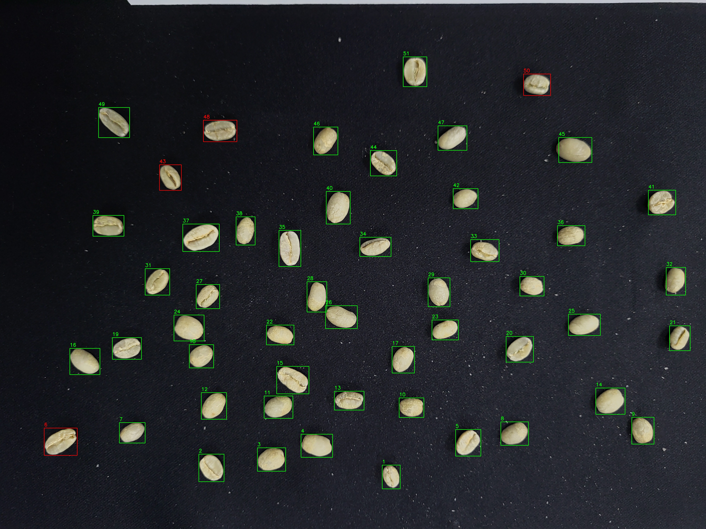

# Coffee Bean Detection

這是一個使用 PyTorch 和 PyTorch Lightning 進行咖啡豆檢測的專案。專案包含資料預處理、模型訓練和結果可視化等功能。
# 注意

使用此專案的python版本為3.11.10，CUDA版本為12.6
若要使用其他版本，請不要直接安裝requirements.txt，請先安裝pytorch，然後根據缺少的package，自行使用pip安裝  
請不要直接拿coffee_bean_dataset來直接跑訓練，那些資料還沒有手動處理過，內有大量錯誤資料  
目前僅確定coffee_bean_training.py可以正常運作  
TODO：將資料集完整建立，並重新調整過參數

## 專案結構

- `utils/`: 包含資料集和模型的工具程式。
  - `coffee_bean_datasets.py`: 定義了 PyTorch 資料集類別。
  - `Models/`: 包含 CNN 模型的定義。
- `coffee_bean_training.py`: 主訓練腳本，負責模型訓練和驗證。
- `image_preprocess.py`: 處理影像資料的腳本。
- `coffee_bean_dataset/`: 包含訓練和測試資料的資料夾。
- `dataset.json`: 包含影像路徑和標籤的 JSON 檔案。

## 安裝

1. clone專案到本地端

   ```bash
   git clone https://github.com/kevin00156/coffee_bean_detection
   cd coffee_bean_detection
   ```  

2. 先安裝pytorch，請參考[pytorch官網](https://pytorch.org/get-started/locally/)

3. 安裝所需的 Python 套件 (記得切換到虛擬環境)：

   ```bash
   pip install -r requirements.txt
   ```

## 使用方法

1. **資料預處理**：

   使用 `dataset_preprocess內的功能` 來處理影像資料，確保所有影像都已正確儲存並標記。  
   詳細參考該資料夾內的 `README.md`
   


4. **模型訓練**：

   使用 `coffee_bean_training.py` 來訓練模型。此腳本會自動拆分資料集並開始訓練。
   請自行參考檔案前段參數定義，調整模型訓練參數
   你可以在utils/Models中新建專屬自己的Model，並在`coffee_bean_training.py`中引用

   ```bash
   python coffee_bean_training.py
   ```

3. **結果可視化**：

   訓練過程中，您可以使用 Dash 應用程式來即時查看訓練和驗證的損失及準確率。
   使用方法：訓練過程中在網頁中打開`localhost:8050`，即可看到可視化結果

   訓練完的結果會被放在'lightning_logs'資料夾中，你可以先在命令行輸入`tensorboard --logdir=lightning_logs`，
   然後在網頁中打開`localhost:6006`，即可看到過往的訓練可視化結果

4. **模型測試**：

   使用 `coffee_bean_model_test.py` 來測試模型。此腳本會自動測試模型，並將結果儲存到`coffee_bean_predict`資料夾中

   ```bash
   python coffee_bean_model_test.py
   ```

   執行結果如下：
   
   

5. **影片測試**：

   使用 `coffee_bean_video_test.py` 來測試模型在影片中的表現。
   只要在main函數中，將path改成你要測試的影片路徑，即可測試
   若使用webcam或local_camera，則更改video_path為網路攝影機地址或0,1,2...等即可使用

   ```bash
   python coffee_bean_video_test.py
   ```

## 貢獻

歡迎對此專案進行貢獻！請提交問題或拉取請求。

## 授權

此專案採用 MIT 授權條款。詳情請參閱 [LICENSE](LICENSE) 文件。
